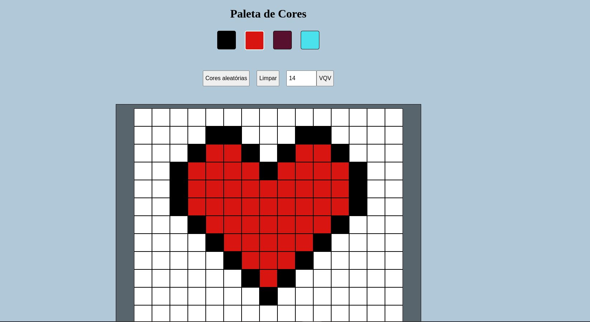
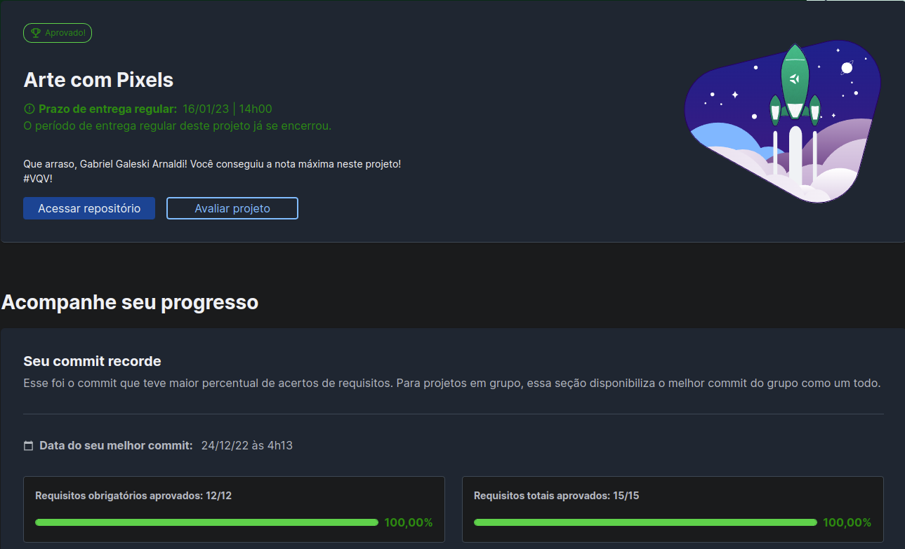

# :notebook_with_decorative_cover: Pixel Art!

 

# :clipboard: About

Projeto utilizando JavaScript, HTML e CSS para criar uma aplicação dinamica e interativa com paleta de cores. Utilizou tambem o local Storage para salvar o desenho feito no quadro e a possibilidade de mudar o tamanho do mesmo.

 

# :hammer_and_wrench: Skills & Tools

  
<strong>JavaScript ES6</strong>
 
  
  - DOM
  - Event Listeners

  
<strong>HTML5</strong>
 

  
<strong>CSS3</strong>
 

